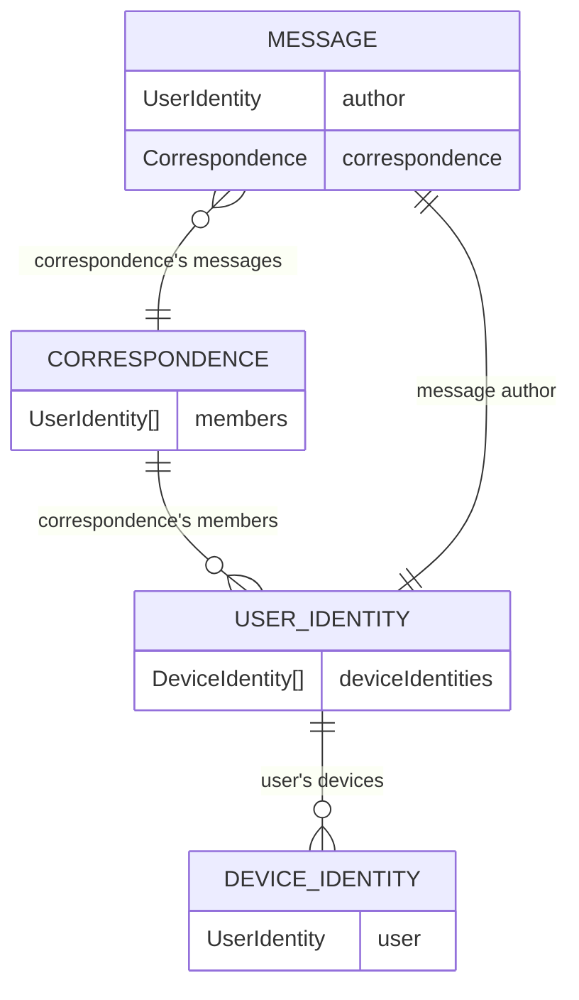

# Endra Architecture

| Endra Object              | Walytis Tech Class                                       | Description                                         |
| ------------------------- | -------------------------------------------------------- | --------------------------------------------------- |
| User Identity / Profile   | GroupDidManager                                          | a user account                                      |
| Device Identity / Profile | GroupDidManager                                          | a device associated with a user account             |
| Message                   | MutaBlock                                                | a message created by a User Identity                |
| Correspondence            | GroupDidManager/ PrivateBlockchain/ MutaBlockchain | a collection of messages by specific set Identities |

- A **User Identity** has one or more devices (**Device Identities**).
- A **Correspondence** has one or more members (**User Identities**).
- A **Message** has one author (**User Identity**) author and one **Correspondence**.

### Notable Features

- With its **Correspondences** (analog to 'chats' or 'chat-rooms' in other messengers), Endra does NOT differentiate between chats that have only two members and chats that have more than two members ('direct chats' and 'group chats').