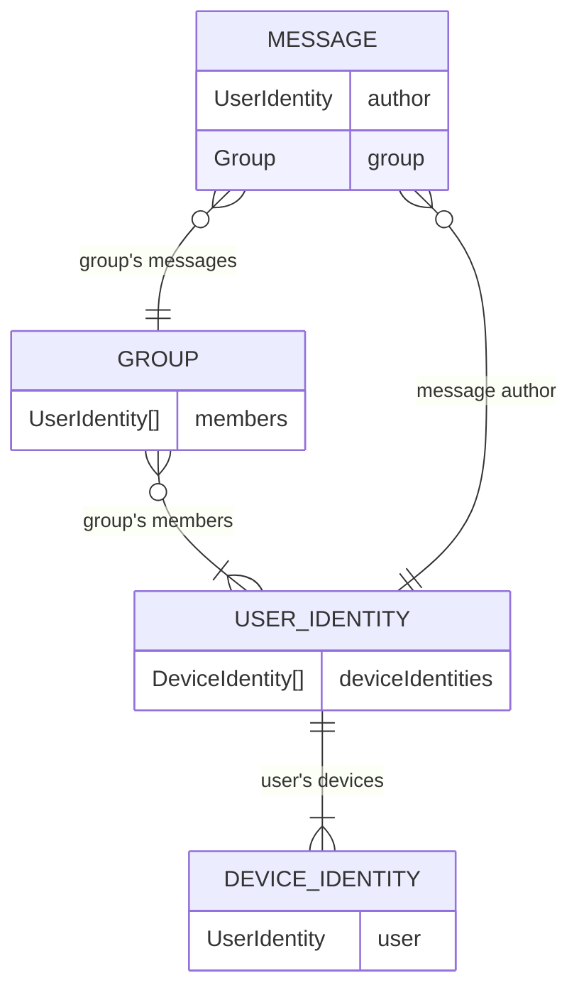

# Messaging Architecture

- A **User** has one or more **Devices**.
- A **Device** profile belongs to one **User** (though multiple **Device** profiles and thereby **User** profiles can be installed in the same instance of the EndraApp).
- A **Group** has one or more members, which are **Users**.
- A Group has a chat-history that can comprise any number of **Messages**.
- A **Message** has one author (a **User**) author belongs to one **Correspondence**.

## Devices, Users, Groups

Under the hood, devices, users and groups function in identical ways, to a large extent.
Each device, user and group is a Walytis-Identities DidManager, which is a Walytis database-blockchain that publishes DIDs and ephemeral cryptographic keys.
Furthermore, each user and group is also a GroupDidManager, which is a DidManager that has members, among which all private keys of the GroupDidManager are securely shared. 
So, a group is a GroupDidManager with users as its members, and a user is a GroupDidManager with devices as its members.
Furthermore, each user is also a `DidManagerWithSupers`, meaning it keeps track of other GroupDidManagers which it is a member of, i.e. it keeps a list of all Groups which the user is a member of, so that all devices belonging to the user always know which groups the user belongs to. 

| Endra Object | Walytis Tech Class                                       | Description                                         |
| ------------ | -------------------------------------------------------- | --------------------------------------------------- |
| Device       | GroupDidManager                                          | a device associated with a user account             |
| User         | GroupDidManager                                          | a user account                                      |
| Group        | GroupDidManager/ PrivateBlockchain/ MutaBlockchain | a collection of messages by specific set Identities |
| Message      | MutaBlock                                                | a message created by a User Identity                |

## Chats and Messages

Chats are systems that allow a specific set of users to share messages among each other, for all of those members to see.

Chats work by each having a unique WalytisIdentities identity, which we call Group.
These groups have members, which are Users.
A chat's messages are indirectly stored on this group identity's database-blockchain, via the blockchain overlays WalytisOffchain for privacy and WalytisMutability to make messages editable and deletable.

Thus, there is no differentiation between bilateral/direct chats between only two users and group chats for more than two users.